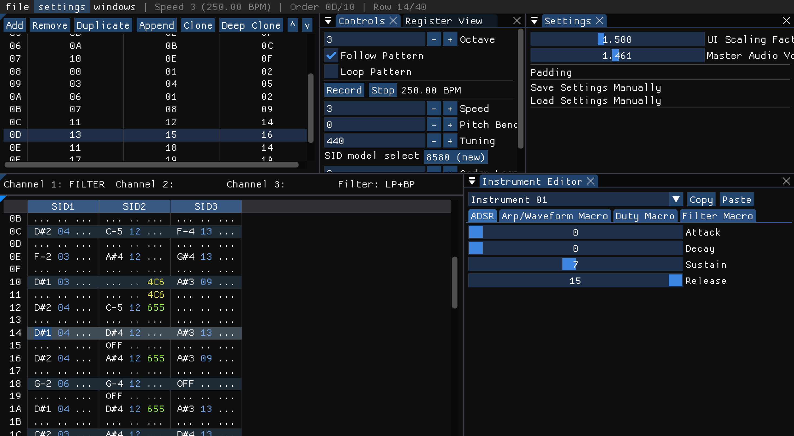

# mah-tracker
AArt1256's custom SID chiptune tracker meant to be easy to use for newcomers and experts alike!



## features
- accurate SID emulation via ReSIDfp
- a clean and modular interface using Dear ImGUI
- instrument editor inspired by Furnace and Sidtracker64 to be easy to use
- file save/loading using a custom .mah format
- **proper** hardware .prg export as a first-class feature (prg export code in [the export folder](export), can be easily modified for .sid export as well)
- many common shortcuts are included, such as transposition, cut/copy/paste and undo/redo (more info in the [shortcuts](#shortcuts) section)
- 6581 and 8580 support included
- ADSR effect commands **(5xy and 6xy)**
- funktempo/swing-tempo support through the **Exy** effect
- per-channel transpose through the **Cxx** effect
- custom pattern lengths (up to 256 rows!)
- custom A-4 tuning (user-definable in the .mah file itself) for changing tuning tables during export!

## support

A community space for talking about, developing and asking help about mah-tracker can be found on [Matrix (#mah-tracker:matrix.aart1256.net)](https://matrix.to/#/#mah-tracker:matrix.aart1256.net).

A Discord server bridged to the Matrix space may be created in the future...

## building
If you want to use ready-made binaries for mah-tracker (from the latest commits), you can go to the [nightly.link](https://nightly.link/AnnoyedArt1256/mah-tracker/workflows/cmake-multi-platform/main) URL for this repo, download the .zip for your OS/architecture, unzip and run the executable in the extracted folder.

Otherwise, you can first clone the contents of this repo with these commands in a terminal/console: 
```
git clone --recursive https://github.com/AnnoyedArt1256/mah-tracker.git
cd mah-tracker
``` 

Then, you can create a `build` directory inside the repo and compile it with cmake like so:
```
mkdir build
cd build
cmake ..
make
```

> NOTE: You need a C/C++ compiler, git and cmake to build mah-tracker from source.

## effects (in the editor)
- 1xx: pitch up
- 2xx: pitch down
- 3.. (or 300): tie note
- 3xx (where xx is a **non-zero** value): glissando/pitch glide
- 4xy: vibrato (x: speed, y: depth)
- 5xy: set attack and decay to XY
- 6xy: set sustain and release to XY
- 9xx: set filter cutoff to XX
- Cxx: set transpose for channel to XX
- Dxx: jump to next pattern
- Exy: set funk tempo (aka two alternating speeds) to be x and y for each speed value
- Fxx: set speed to xx

## shortcuts
### pattern editor:
- up/down/left/right: move the cursor in that direction
- space: switch between read-only ("Jam") and read-write ("Record") modes. this can also be done through the Jam/Record button in the Controls window.
- enter: play the song beginning from the current pattern
- **1**: put a note cut/off in the selected channel's row (IF the cursor is over a note)
<br><br>
- ctrl+c: **copy** note/selection
- ctrl+x: **cut** note/selection
- ctrl+v: **paste** note/selection
- ctrl+z: **undo** note/selection
- ctrl+y: **redo** note/selection
<br><br>
- backspace/delete: delete current note/selection
<br><br>
- ctrl/cmd+f1: transpose note/selection by +1 semitone
- ctrl/cmd+f2: transpose note/selection by -1 semitone
- ctrl/cmd+f3: transpose note/selection by +1 octave (+12 semitones)
- ctrl/cmd+f4: transpose note/selection by -1 octave (-12 semitones)

## legal
The **tracker GUI** in C++ is distributed under the GPLv2 license as shown in [LICENSE](LICENSE)

**HOWEVER** the [SID export player](export/driver.asm)  and its [accompanying converter](export/convert.py) is **NOT** included within the GPL license, it's in the public domain so use it whenever and wherever you want to!